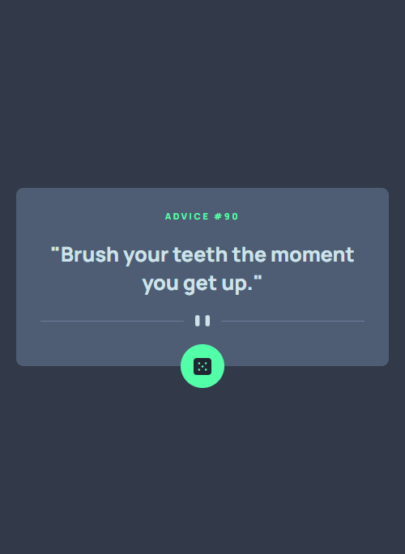
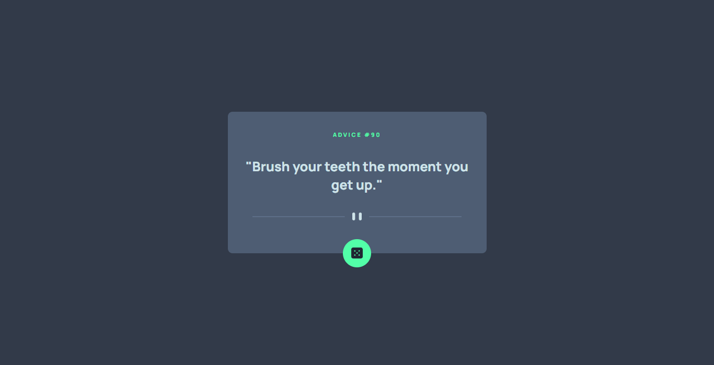
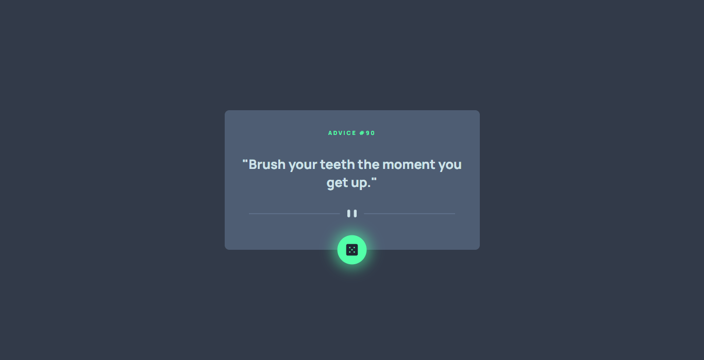

# Frontend Mentor - Advice generator app solution

This is a solution to the [Advice generator app challenge on Frontend Mentor](https://www.frontendmentor.io/challenges/advice-generator-app-QdUG-13db). Frontend Mentor challenges help you improve your coding skills by building realistic projects.

## Table of contents

- [Overview](#overview)
  - [The challenge](#the-challenge)
  - [Screenshot](#screenshot)
  - [Links](#links)
- [My process](#my-process)
  - [Built with](#built-with)
  - [What I learned](#what-i-learned)
  - [Continued development](#continued-development)
  - [Useful resources](#useful-resources)
- [Author](#author)

**Note: Delete this note and update the table of contents based on what sections you keep.**

## Overview

### The challenge

Users should be able to:

- View the optimal layout for the app depending on their device's screen size
- See hover states for the interactive elements on the page
- See a new piece of advice when the dice icon is clicked

### Screenshot

### Links

- Solution URL: [Add solution URL here](https://your-solution-url.com)
- Live Site URL: [Add live site URL here](https://your-live-site-url.com)

## My process

### Built with

- Semantic HTML5 markup
- CSS custom properties
- Flexbox
- CSS Grid
- Mobile-first workflow

### What I learned

I am doing a course on front-end development. I wanted to test out my Js skills as I go through the course. This particular project had a relatively simple html and css part.
I've come to realize that I still need to practice my Js skills a lot.

### Continued development

I will have to focus on projects that involve DOM manipulation in the future. I need to get comfortable with it. I also plan to do a course on React in the near future. I'll probably get back to this project to improvise it in any way possible in the future.

### Useful resources

- [Resource 1](https://javascript.info/) - This helped me out with promises and async Js that I needed to understand to complete this project

## Author

- GitHub - [@MashX27](https://github.com/MashX27)
- Frontend Mentor - [@MashX27](https://www.frontendmentor.io/profile/MashX27)
